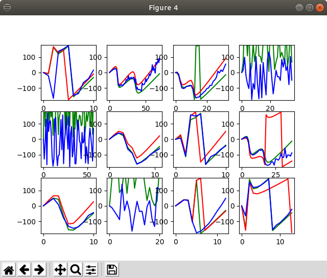

# PhaseNN

Modelling sinusoidal codec phase spectra with neural nets.

## Introduction

Recent breakthroughs in (Neural Net) NN speech synthesis (WaveNet, WaveRNN, LPCNet and friends) have resulted in exciting improvements in model based synthesised speech quality.  These algorithms typically use NNs to estimate the PDF of the next speech sample conditioned on input features and a history of previously synthesised speech samples.  This PDF is then sampled to obtain the next output speech sample.  As the algorithms need all previous output speech samples, speech must be generated on a sample by sample basis.  Computational complexity is high, although steadily being reduced.

Speech codecs employing frequency domain, block based techniques such as sinusoidal transform coding can deliver communications quality speech using block based synthesis.  They typically synthesise speech in blocks of 10-20ms at a time (e.g. 160-320 samples at Fs=16kHz) using efficient overlap-add IDFT techniques.  Sinusoidal codecs use a similar parameter set to the features used for NN based synthesis systems (some form of amplitude spectra, pitch information, voicing).

The trade off is that sinusoidal models tend to have some baseline artefacts, so can't reach the high-end quality levels as NN systems that operate in the sample by sample mulaw domain.  These artefacts are due to occasional errors in the model parameter estimation (e.g. pitch, voicing), and the underlying assumption (that speech can be modelled by a harmonic series of sinusoids).

Sinusoidal codecs require a suitable set of the sinusoidal harmonic phases for each frame that is synthesised. This work aims to generate the sinusoid phases from amplitude information using NNs, in order to develop a block based NN synthesis engine based on sinusoidal coding.

## Literature Review (November 2020)

Since I started this work in August 2019, several papers have appeared with teams using sinusoidal speech production models with Neural Nets [1][2][3]:
1. They use mixed harmonic sinusoid plus noise.
1. When trained on a single female speaker, high speech quality is obtained.  However so far it seems limit to single speakers, which is OK for "copy synthesis", but not codecs where speaker Independence is important.  Also males are much more sensitive to phase.
1. They use NN to train DSP components such as filters - similar to the phase NN work her, where I am using a freq domain all pass filter to model phase.
1. Low CPU complexity using feed forward/block based/freq domain rather than autoregressive NNs.
1. In some cases F0 (pitch) is also estimated using NNs.

## Status (Dec 2019)

Successful synthesis of sinusoidal phases for voiced speech using NNs.
Quality similar to DSP based techniques (e.g. Hilbert Transforms, sampling LPC filter phase).

## Challenges

1. We must represent phase (angles) in a NN.  Phase is being represented by (cos(angle), sin(angle)) pairs, which when trained, tend to develop weights that behave like complex numbers/matrix rotations.
1. The number of phases in the sinsuoidal model is time varying, based on the pitch of the current frame.  This is being addressed by mapping the frequency of each sinusoid onto the index a sparse, fixed length vector. 

## Example

Here is the output from [phasenn_test11.py](phasenn_test11.py).  The first plot is a series of (log) magnitude spectra of simulated speech frames.  The voiced frames have two fairly sharp peaks (formants) beneath Fs/2 with structured phase consisting of linear and dispersive terms.  Unvoiced frames have less sharp peaks above Fs/2, and random phases.

The next plot shows the disperive component of the original phase spectra (green), the phase spectra with an estimate of the linear phase term removed (red), and the NN output estimated dispersive phase (blue).  The y-axis is the phase angle in degrees. For voiced frames, we would like green (original) and blue (NN estimate) to match.  In particular we want to model the rapid phase shift across the peak of the amplitude spectra - this is the dispersive term that shifts the phase of high energy speech harmonics apart and reduces the buzzy/unnatural quality in synthsised speech.

When training from real world data, we have frames of phase spectra with the linear and dispersive phase components combined. We will not know the linear term, and therefore must estimate it. This simulation introduces small errors in the linear term estimation (+/-1 sample), which can lead to large phase differences at high frequencies.  The red (original phase with estimated linear term removed) diverges from the true dispersive input (green), as the estimation of the linear term is not perfect.  However over the training database these errors tend to have a zero mean - this simulation suggests they are being "trained out" by the NN, resulting in a reasonable model of the dispersive term (blue), albiet with some estimation "noise" at high frequencies.  This HF noise may be useful, as it matches the lack of structure of HF phases in real speech.

For unvoiced speech, we want the NN output (blue) to be random.  They do not need to match the original input phase spectra. The NN appears to preserve this random phase structure in this simulation.  This may remove the need for a voicing estimate - voicing can be deduced from the magnitude spectra.

## References

[1] Wang et al, "Neural Harmonic-plus-Noise Waveform Model with Trainable Maximum Voice Frequency for Text-to-Speech Synthesis", 2019
[2] Engel et all, "DDSP: DIFFERENTIABLE DIGITAL SIGNAL PROCESSING", 2020
[3] Liu et al, "Neural Homomorphic Vocoder", 2020
